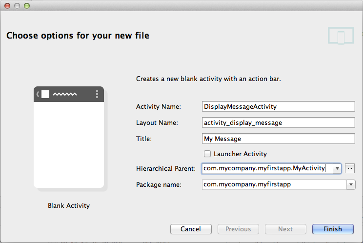

# 启动另一个Activity

> 编写:[yuanfentiank789](https://github.com/yuanfentiank789) - 原文:<http://developer.android.com/training/basics/firstapp/starting-activity.html>

在完成上一课(建立简单的用户界面)后，我们已经拥有了显示一个activity（一个界面）的app（应用），该activity包含了一个文本字段和一个按钮。在这节课中，我们将添加一些新的代码到`MyActivity`中，当用户点击发送(Send)按钮时启动一个新的activity。

## 响应Send(发送)按钮

1 在Android Studio中打开res/layout目录下的content_my.xml 文件.

2 为 Button 标签添加[android:onclick](http://developer.android.com/reference/android/view/View.html#attr_android:onClick)属性.

res/layout/content_my.xml


```
<Button
    android:layout_width="wrap_content"
    android:layout_height="wrap_content"
    android:text="@string/button_send"
    android:onClick="sendMessage" />
```

`android:onclick`属性的值`"sendMessage"`即为用户点击屏幕按钮时触发方法的名字。

3 打开java/com.mycompany.myfirstapp目录下MyActivity.java 文件.

4 在MyActivity.java 中添加sendMessage() 函数：

java/com.mycompany.myfirstapp/MyActivity.java

```
/** Called when the user clicks the Send button */
public void sendMessage(View view) {
    // Do something in response to button
}

```

为使系统能够将该方法（你刚在MyActivity.java中添加的sendMessage方法）与在`android:onClick`属性中提供的方法名字匹配，它们的名字必须一致，特别需要注意的是，这个方法必须满足以下条件：

* 是public函数
* 无返回值
* 参数唯一(为View类型,代表被点击的视图）

接下来，你可以在这个方法中编写读取文本内容，并将该内容传到另一个Activity的代码。

## 构建一个Intent

>[Intent](http://developer.android.com/reference/android/content/Intent.html)是在不同组件中(比如两个Activity)提供运行时绑定的对象。`Intent`代表一个应用"想去做什么事"，你可以用它做各种各样的任务，不过大部分的时候他们被用来启动另一个Activity。更详细的内容可以参考[Intents and Intent Filters](http://developer.android.com/guide/components/intents-filters.html)。

1 在MyActivity.java的`sendMessage()`方法中创建一个`Intent`并启动名为`DisplayMessageActivity`的Activity：

java/com.mycompany.myfirstapp/MyActivity.java

```
Intent intent = new Intent(this, DisplayMessageActivity.class);
```
>**Note**：如果使用的是类似Android Studio的IDE，这里对`DisplayMessageActivity`的引用会报错，因为这个类还不存在；暂时先忽略这个错误，我们很快就要去创建这个类了。

在这个Intent构造函数中有两个参数：

* 第一个参数是[Context](http://developer.android.com/reference/android/content/Context.html)(之所以用`this`是因为当前[Activity](http://developer.android.com/reference/android/app/Activity.html)是`Context`的子类)

* 接受系统发送[Intent](http://developer.android.com/reference/android/content/Intent.html)的应用组件的[Class](http://developer.android.com/reference/java/lang/Class.html)（在这个案例中，指将要被启动的activity）。

Android Studio会提示导入[Intent](http://developer.android.com/reference/android/content/Intent.html)类。

2 在文件开始处导入[Intent](http://developer.android.com/reference/android/content/Intent.html)类:

java/com.mycompany.myfirstapp/MyActivity.java

```
import android.content.Intent;
```

 >**Tip:**在Android Studio中，按Alt + Enter 可以导入缺失的类(在Mac中使用option + return)

3 在`sendMessage()`方法里用<a href="http://developer.android.com/reference/android/app/Activity.html#findViewById(int)">findViewById()</a>方法得到[EditText](http://developer.android.com/reference/android/widget/EditText.html)元素.

java/com.mycompany.myfirstapp/MyActivity.java

```
public void sendMessage(View view) {
  Intent intent = new Intent(this, DisplayMessageActivity.class);
  EditText editText = (EditText) findViewById(R.id.edit_message);
}
```

4 在文件开始处导入EditText类.

在Android Studio中，按Alt + Enter 可以导入缺失的类(在Mac中使用option + return)

5 把EditText的文本内容关联到一个本地 message 变量，并使用putExtra()方法把值传给intent.

java/com.mycompany.myfirstapp/MyActivity.java

```
public void sendMessage(View view) {
  Intent intent = new Intent(this, DisplayMessageActivity.class);
  EditText editText = (EditText) findViewById(R.id.edit_message);
  String message = editText.getText().toString();
  intent.putExtra(EXTRA_MESSAGE, message);
}
```
[Intent](http://developer.android.com/reference/android/content/Intent.html)可以携带称作 *extras* 的键-值对数据类型。 <a href="http://developer.android.com/reference/android/content/Intent.html#putExtra(java.lang.String, android.os.Bundle)">putExtra()</a>方法把键名作为第一个参数，把值作为第二个参数。

6 在MyActivity class,定义EXTRA_MESSAGE :

java/com.mycompany.myfirstapp/MyActivity.java

```
public class MyActivity extends ActionBarActivity {
    public final static String EXTRA_MESSAGE = "com.mycompany.myfirstapp.MESSAGE";
    ...
}
```
为让新启动的activity能查询extra数据。定义key为一个public型的常量，通常使用应用程序包名作为前缀来定义键是很好的做法，这样在应用程序与其他应用程序进行交互时仍可以确保键是唯一的。

7 在sendMessage()函数里，调用startActivity()完成新activity的启动，现在完整的代码应该是下面这个样子：

java/com.mycompany.myfirstapp/MyActivity.java

```
/** Called when the user clicks the Send button */
public void sendMessage(View view) {
    Intent intent = new Intent(this, DisplayMessageActivity.class);
    EditText editText = (EditText) findViewById(R.id.edit_message);
    String message = editText.getText().toString();
    intent.putExtra(EXTRA_MESSAGE, message);
    startActivity(intent);
}
```

运行这个方法，系统收到我们的请求后会实例化在`Intent`中指定的`Activity`，现在需要创建一个`DisplayMessageActivity`类使程序能够执行起来。


## 创建第二个Activity


Activity所有子类都必须实现onCreate()方法。创建activity的实例时系统会调用该方式，此时必须用 setContentView()来定义Activity布局，以对Activity进行初始化。


### 使用Android Studio创建新的Activity

使用Android Studio创建的activity会实现一个默认的onCreate()方法.


1. 在Android Studio的java 目录, 选择包名 **com.mycompany.myfirstapp**,右键选择 **New > Activity > Blank Activity**.

2. 在**Choose options**窗口，配置activity：
<ul>
<li><strong>Activity Name</strong>: DisplayMessageActivity

<li><strong>Layout Name</strong>: activity_display_message

<li><strong>Title</strong>: My Message

<li><strong>Hierarchical Parent</strong>: com.mycompany.myfirstapp.MyActivity

Package name: com.mycompany.myfirstapp
</ul>
点击 **Finish**.




3 打开DisplayMessageActivity.java文件，此类已经实现了onCreate()方法，稍后需要更新此方法。


如果使用 Android Studio开发，现在已经可以点击Send按钮启动这个activity了，但显示的仍然是模板提供的默认内容"Hello world"，稍后修改显示自定义的文本内容。


### 使用命令行创建activity

如果使用命令行工具创建activity，按如下步骤操作：

1 在工程的src/目录下，紧挨着MyActivity.java创建一个新文件DisplayMessageActivity.java.

2 写入如下代码：


```
public class DisplayMessageActivity extends AppCompatActivity {

    @Override
    protected void onCreate(Bundle savedInstanceState) {
        super.onCreate(savedInstanceState);
        setContentView(R.layout.activity_display_message);

        if (savedInstanceState == null) {
            getSupportFragmentManager().beginTransaction()
                .add(R.id.container, new PlaceholderFragment()).commit();
        }
    }

    @Override
    public boolean onOptionsItemSelected(MenuItem item) {
        // Handle action bar item clicks here. The action bar will
        // automatically handle clicks on the Home/Up button, so long
        // as you specify a parent activity in AndroidManifest.xml.
        int id = item.getItemId();
        if (id == R.id.action_settings) {
            return true;
        }
        return super.onOptionsItemSelected(item);
    }

    /**
     * A placeholder fragment containing a simple view.
     */
    public static class PlaceholderFragment extends Fragment {

        public PlaceholderFragment() { }

        @Override
        public View onCreateView(LayoutInflater inflater, ViewGroup container,
                  Bundle savedInstanceState) {
              View rootView = inflater.inflate(R.layout.fragment_display_message,
                      container, false);
              return rootView;
        }
    }
}
```


> **Note**:如果使用的IDE不是 Android Studio，工程中可能不会包含由`setContentView()`请求的`activity_display_message` layout，但这没关系，因为等下会修改这个方法。

3 把新Activity的标题添加到strings.xml文件:

```
<resources>
    ...
    <string name="title_activity_display_message">My Message</string>
</resources>
```

4 在 AndroidManifest.xml的Application 标签内为 DisplayMessageActivity添加 <activity\>标签，如下:

```
<application ... >
    ...
    <activity
        android:name="com.mycompany.myfirstapp.DisplayMessageActivity"
        android:label="@string/title_activity_display_message"
        android:parentActivityName="com.mycompany.myfirstapp.MyActivity" >
        <meta-data
            android:name="android.support.PARENT_ACTIVITY"
            android:value="com.mycompany.myfirstapp.MyActivity" />
    </activity>
</application>
```

`android:parentActivityName`属性声明了在应用程序中该Activity逻辑层面的父类Activity的名称。 系统使用此值来实现默认导航操作，比如在Android 4.1（API level 16）或者更高版本中的[Up navigation](http://developer.android.com/design/patterns/navigation.html)。 使用[Support Library](http://developer.android.com/tools/support-library/index.html)，如上所示的[`<meta-data>`](http://developer.android.com/guide/topics/manifest/meta-data-element.html)元素可以为安卓旧版本提供相同功能。

 >**Note**:我们的Android SDK应该已经包含了最新的Android Support Library，它包含在ADT插件中。但如果用的是别的IDE，则需要在[ Adding Platforms and Packages ](http://developer.android.com/sdk/installing/adding-packages.html)中安装。当Android Studio中使用模板时，Support Library会自动加入我们的工程中(在Android Dependencies中你以看到相应的JAR文件)。如果不使用Android Studio，就需要手动将Support Library添加到我们的工程中，参考[setting up the Support Library](http://developer.android.com/tools/support-library/setup.html)。


## 接收Intent

不管用户导航到哪，每个[Activity](http://developer.android.com/reference/android/app/Activity.html)都是通过[Intent](http://developer.android.com/reference/android/content/Intent.html)被调用的。我们可以通过调用<a href="http://developer.android.com/reference/android/app/Activity.html#getIntent()">getIntent()</a>来获取启动activity的[Intent](http://developer.android.com/reference/android/content/Intent.html)及其包含的数据。

1 编辑java/com.mycompany.myfirstapp目录下的DisplayMessageActivity.java文件.

2 得到intent 并赋值给本地变量.

```
Intent intent = getIntent();
```
3 为Intent导入包.

在Android Studio中，按Alt + Enter 可以导入缺失的类(在Mac中使用option + return).

4 调用 getStringExtra()提取从 MyActivity 传递过来的消息.

```
String message = intent.getStringExtra(MyActivity.EXTRA_MESSAGE);
```


## 显示文本

1 在res/layout目录下，编辑文件`content_display_message.xml`.

2 为<RelativeLayout>标签添加id属性，你之后需要用这个id属性来调用这个对象.

```
< RelativeLayout xmlns:android="http://schemas.android.com/apk/res/android"
...
android:id="@+id/content">
</RelativeLayout>
```

3 重新来编辑`DisplayMessageActivity.java`

4 在`onCreate()`方法中创建一个对象`TextView`

```
TextView textView = new TextView(this);
```

5 用`setText()`来设置文本字体大小和内容.

```
textView.setTextSize(40);
textView.setText(message);
```
6 将`TextView`加入之前被标记为`R.id.content`的`RelativeLayout`中

```
RelativeLayout layout = (RelativeLayout) findViewById(R.id.content);
layout.addView(textView);
```

7 为TextView 导入包.

在Android Studio中，按Alt + Enter 可以导入缺失的类(在Mac中使用option + return).

DisplayMessageActivity的完整onCreate()方法应该如下：


```
@Override
protected void onCreate(Bundle savedInstanceState) {
   super.onCreate(savedInstanceState);
   setContentView(R.layout.activity_display_message);
   Toolbar toolbar = (Toolbar) findViewById(R.id.toolbar);
   setSupportActionBar(toolbar);

   FloatingActionButton fab = (FloatingActionButton) findViewById(R.id.fab);
   fab.setOnClickListener(new View.OnClickListener() {
       @Override
       public void onClick(View view) {
           Snackbar.make(view, "Replace with your own action", Snackbar.LENGTH_LONG)
                   .setAction("Action", null)
                   .show();
       }
   });
   getSupportActionBar().setDisplayHomeAsUpEnabled(true);

   Intent intent = getIntent();
   String message = intent.getStringExtra(MyActivity.EXTRA_MESSAGE);
   TextView textView = new TextView(this);
   textView.setTextSize(40);
   textView.setText(message);

   RelativeLayout layout = (RelativeLayout) findViewById(R.id.content);
   layout.addView(textView);
}```

现在你可以运行app，在文本中输入信息，点击Send(发送)按钮，ok，现在就可以在第二Activity上看到发送过来信息了。如图：


到此为止，已经创建好我们的第一个Android应用了！
